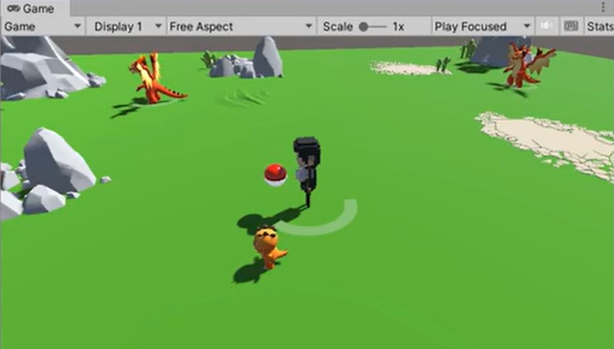
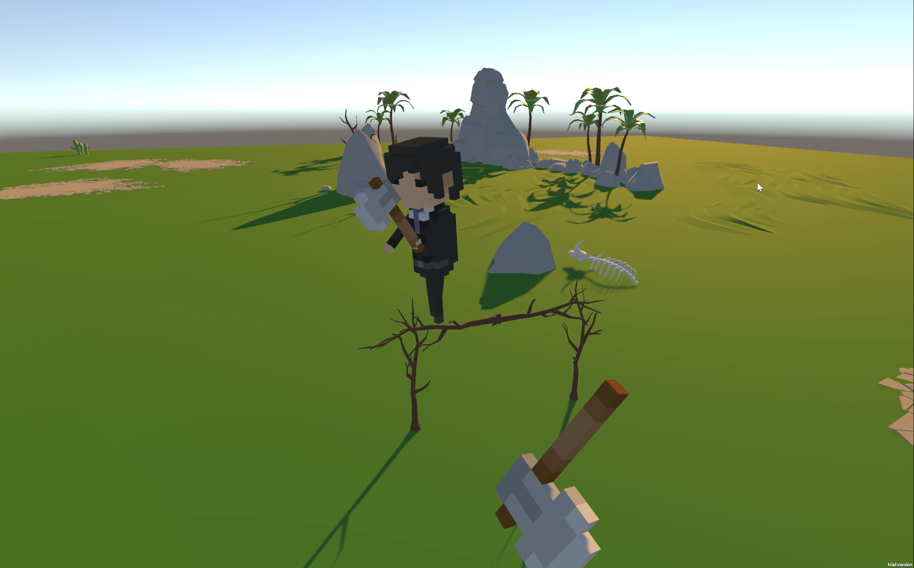

## Mimic_Pokémon
### Overview
This is a Unity game project.

You can find all source code in /src. 

Run game.exe to play the game.

    Use "WASD" to control the movement of the player
    Use "space" jump 
    Use mouse left click to throw the axe to attact
    Use mouse right click to throw the Poké Ball to catch creatures

  

  

